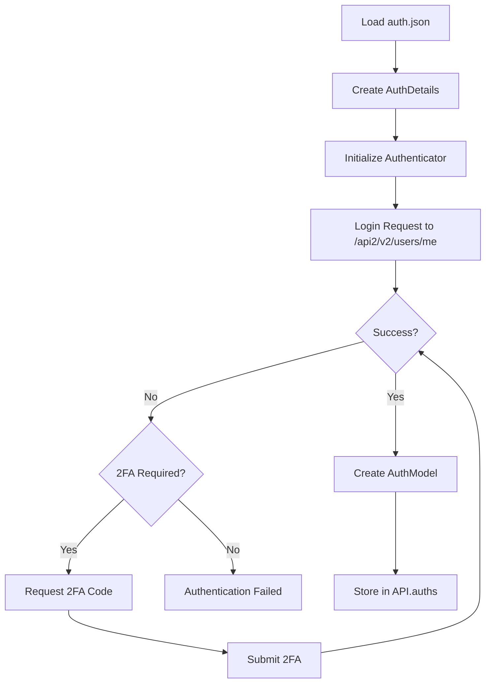
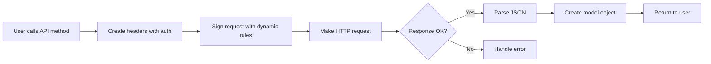

# UltimaScraperAPI - Codebase Documentation

## Table of Contents
1. [Overview](#overview)
2. [Architecture](#architecture)
3. [Project Structure](#project-structure)
4. [Core Components](#core-components)
5. [Authentication Flow](#authentication-flow)
6. [API Request Flow](#api-request-flow)
7. [Data Models](#data-models)
8. [Session Management](#session-management)
9. [Error Handling](#error-handling)
10. [Usage Examples](#usage-examples)

## Overview

UltimaScraperAPI is a Python library that provides programmatic access to OnlyFans and Fansly platforms. It's designed as a **read-only scraping API** that allows users to fetch content, messages, posts, and other data from these platforms.

### Key Features:
- 🔐 Cookie-based authentication
- 📥 Content fetching (posts, messages, stories, etc.)
- 💬 Message retrieval and search
- 👥 User and subscription management
- 🔒 DRM content handling
- 🌐 Multi-platform support (OnlyFans & Fansly)

## Architecture

```
┌─────────────────────────────────────────────────────────────┐
│                        User Application                       │
├─────────────────────────────────────────────────────────────┤
│                      API Function Layer                       │
│  ┌─────────────┐  ┌──────────────┐  ┌──────────────────┐   │
│  │   OnlyFans   │  │    Fansly    │  │  Other Platforms │   │
│  │     API      │  │     API      │  │    (Future)      │   │
│  └─────────────┘  └──────────────┘  └──────────────────┘   │
├─────────────────────────────────────────────────────────────┤
│                    Authentication Layer                       │
│  ┌─────────────────────────────────────────────────────┐    │
│  │         Authenticators & Auth Models                 │    │
│  └─────────────────────────────────────────────────────┘    │
├─────────────────────────────────────────────────────────────┤
│                     Session Management                        │
│  ┌─────────────────────────────────────────────────────┐    │
│  │    HTTP Sessions, Rate Limiting, Request Handling   │    │
│  └─────────────────────────────────────────────────────┘    │
├─────────────────────────────────────────────────────────────┤
│                        Data Models                            │
│  ┌──────┐  ┌──────┐  ┌────────┐  ┌────────┐  ┌──────┐     │
│  │ User │  │ Post │  │Message │  │ Story  │  │ etc. │     │
│  └──────┘  └──────┘  └────────┘  └────────┘  └──────┘     │
└─────────────────────────────────────────────────────────────┘
```

## Project Structure

```
UltimaScraperAPI/
├── ultima_scraper_api/          # Main package
│   ├── __init__.py             # Package initialization
│   ├── config.py               # Configuration classes
│   │
│   ├── apis/                   # Platform-specific APIs
│   │   ├── api_streamliner.py  # Base API class
│   │   ├── auth_streamliner.py # Base auth class
│   │   ├── user_streamliner.py # User management
│   │   │
│   │   ├── onlyfans/          # OnlyFans implementation
│   │   │   ├── onlyfans.py    # Main OnlyFans API
│   │   │   ├── authenticator.py
│   │   │   └── classes/       # OnlyFans models
│   │   │       ├── auth_model.py
│   │   │       ├── user_model.py
│   │   │       ├── post_model.py
│   │   │       ├── message_model.py
│   │   │       ├── story_model.py
│   │   │       └── ...
│   │   │
│   │   └── fansly/            # Fansly implementation
│   │       └── (similar structure)
│   │
│   ├── managers/              # Core managers
│   │   ├── session_manager.py # HTTP session handling
│   │   └── scrape_manager.py  # Scraping coordination
│   │
│   └── helpers/               # Utility functions
│       └── main_helper.py
│
├── auth.json                  # Authentication credentials
├── examples/                  # Usage examples
├── logs/                      # Log files
└── requirements.txt          # Dependencies
```

## Core Components

### 1. **Main API Classes**

#### OnlyFansAPI (`onlyfans.py`)
The main entry point for OnlyFans interactions:

```python
class OnlyFansAPI(StreamlinedAPI):
    def __init__(self, config: UltimaScraperAPIConfig):
        # Initialize with configuration
        # Fetch dynamic rules from GitHub
        # Set up authenticator
```

Key responsibilities:
- Manages authentication states
- Provides login methods
- Handles user cache
- Fetches dynamic API rules

### 2. **Authentication System**

#### AuthDetails (`extras.py`)
Stores authentication credentials:
```python
class AuthDetails:
    id: int              # User ID
    username: str        # Username
    cookie: CookieParser # Parsed cookies
    x_bc: str           # Browser check token
    user_agent: str     # Browser user agent
```

#### OnlyFansAuthenticator (`authenticator.py`)
Handles the authentication process:
- Validates credentials
- Creates authenticated sessions
- Manages 2FA if needed
- Handles login errors

### 3. **Data Models**

Each content type has its own model class:

#### UserModel
```python
class UserModel:
    # User profile data
    id: int
    username: str
    name: str
    about: str
    posts_count: int
    
    # Methods to fetch content
    async def get_posts()
    async def get_messages()
    async def get_stories()
```

#### PostModel
```python
class PostModel:
    # Post data
    id: str
    text: str
    price: int
    media: list
    created_at: datetime
    
    # Methods
    async def get_comments()
    async def buy_ppv()
```

#### MessageModel
```python
class MessageModel:
    # Message data
    id: str
    text: str
    price: int
    is_free: bool
    is_tip: bool
    
    # Methods
    async def buy_message()
    def get_author()
```

### 4. **Session Management**

#### SessionManager (`session_manager.py`)
Handles all HTTP requests:
- Creates aiohttp sessions
- Manages cookies and headers
- Implements rate limiting
- Handles retries
- Signs requests with dynamic rules

```python
class SessionManager:
    async def json_request(url, method="GET", payload=None):
        # Make authenticated API request
        # Handle rate limiting
        # Parse JSON response
```

## Authentication Flow



### auth.json Structure:
```json
{
  "auth": {
    "id": 123456789,
    "cookie": "auth_id=xxx; sess=xxx; auth_hash=xxx; ...",
    "x_bc": "browser_check_token",
    "user_agent": "Mozilla/5.0 ..."
  }
}
```

## API Request Flow



### Example: Fetching Messages
```python
# 1. User calls method
messages = await user.get_messages(limit=20)

# 2. UserModel creates API endpoint
url = f"/api2/v2/chats/{chat_id}/messages?limit=20"

# 3. SessionManager adds authentication
headers = create_headers(dynamic_rules, auth_id, x_bc, user_agent)

# 4. Make request
response = await session.request("GET", url, headers=headers)

# 5. Parse and return MessageModel objects
return [MessageModel(msg) for msg in response["list"]]
```

## Session Management

The `SessionManager` is the core of all API communication:

### Features:
1. **Connection Pooling**: Reuses HTTP connections
2. **Rate Limiting**: Prevents API throttling
3. **Cookie Management**: Maintains session state
4. **Request Signing**: Uses dynamic rules for API signatures
5. **Error Handling**: Retries on failures

### Dynamic Rules:
The API fetches rules from GitHub that specify:
- Required headers
- URL signing algorithms
- API endpoints
- Rate limits

## Error Handling

The API uses a multi-layer error handling approach:

### 1. **Network Errors**
- Connection timeouts
- Rate limiting (429 errors)
- Server errors (5xx)

### 2. **Authentication Errors**
- Invalid cookies
- Expired sessions
- 2FA requirements

### 3. **API Errors**
- User not found
- Content not available
- Insufficient permissions

### Error Model:
```python
class ErrorDetails:
    code: int
    message: str
    
    async def format(self, extras):
        # Format error message based on context
```

## Usage Examples

### Basic Usage:
```python
# Initialize API
api = OnlyFansAPI()

# Authenticate
authed = await api.login(auth_json)

# Get user
user = await authed.get_user("username")

# Fetch content
posts = await user.get_posts(limit=50)
messages = await user.get_messages(limit=100)
```

### Advanced Usage:
```python
# Search messages
results = await user.search_messages(text="keyword")

# Get subscriptions
subs = await authed.get_subscriptions(sub_type="active")

# Buy content
post = await user.get_post(post_id)
await post.buy_ppv()
```

## Key Design Patterns

### 1. **Factory Pattern**
- `create_auth()` creates appropriate auth models
- `convert_api_type_to_key()` creates content type handlers

### 2. **Decorator Pattern**
- `@check_auth` decorators verify authentication
- Error handling decorators

### 3. **Async/Await Pattern**
- All API calls are asynchronous
- Enables concurrent requests

### 4. **Repository Pattern**
- Models handle their own data fetching
- Separation of concerns

## Security Considerations

1. **Credentials**: Stored locally in `auth.json`
2. **No Password Storage**: Uses cookies only
3. **HTTPS Only**: All API calls use SSL
4. **No Data Upload**: Read-only API
5. **Local Processing**: No external data transmission

## Limitations

1. **Read-Only**: Cannot create posts or send messages
2. **Cookie-Based**: Requires valid browser session
3. **Rate Limited**: Subject to platform limits
4. **Platform Changes**: May break with API updates

## Future Enhancements

1. **Posting Capabilities**: Add content creation
2. **More Platforms**: Support additional sites
3. **Webhook Integration**: Real-time notifications
4. **Database Storage**: Persistent data storage
5. **Web Interface**: GUI for easier use

## Conclusion

UltimaScraperAPI provides a well-structured, extensible framework for interacting with content platforms. Its modular design allows for easy addition of new platforms and features while maintaining clean separation of concerns.